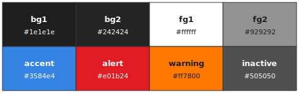

# UI Theme

| Role     | Hex     | Usage                            |
|----------|---------|----------------------------------|
| bg1      | #1e1e1e | Window and panel background      |
| bg2      | #242424 | Bar background                   |
| fg1      | #ffffff | Primary text on dark backgrounds |
| fg2      | #929292 | Secondary or dull text           |
| accent   | #3584e4 | Focus and selected indicators    |
| alert    | #e01b24 | Medium priority warnings         |
| warning  | #ff7800 | High priority warnings           |
| inactive | #505050 | Inactive window borders          |
